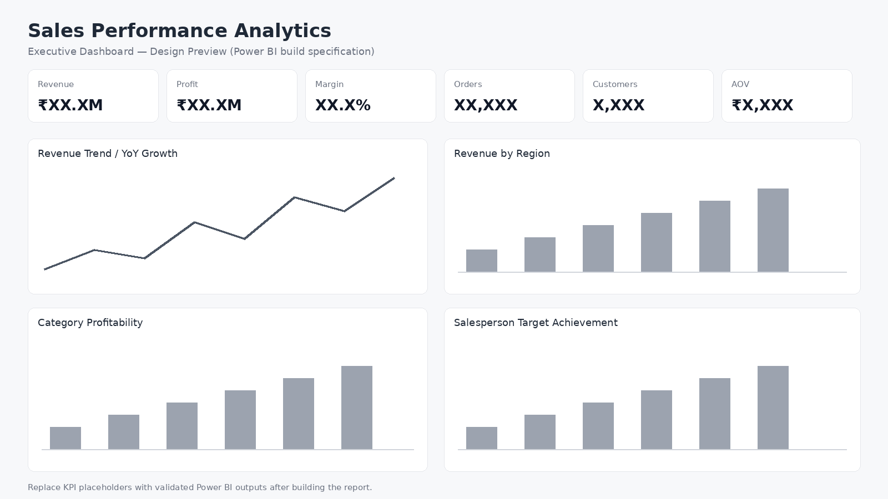

# Sales Performance Analytics

**MySQL • Power BI • DAX • Power Query • Excel**



> End-to-end portfolio project for sales, profitability, customer, regional and salesperson performance analysis.


**Advanced End-to-End Data Analytics Portfolio Project**

> SQL + Power BI + DAX + Power Query + Excel | Business Intelligence | Sales Analytics

## 1. Project Overview

This portfolio project simulates an omnichannel technology and office-solutions business and demonstrates how a Data Analyst can transform raw transactional data into an executive decision-support system.

The project covers the full analytics lifecycle:

**Raw Data → Data Quality → SQL Analysis → Data Modelling → DAX → Power BI Dashboard → Business Insights**

Dataset size: **36,000 sales transactions** across **2024–2025**, with customer, product, salesperson, region, channel and target dimensions.

> All company, customer and transaction data are fictional and created for portfolio/learning purposes.

## 2. Business Problem

Management needs a single interactive view of:

- Revenue and profit performance
- YoY growth
- Product/category performance
- Regional performance
- Salesperson target achievement
- Customer contribution and segmentation
- Channel profitability
- Return/cancellation patterns

## 3. Tools

- **MySQL** — relational modelling, joins, CTEs, aggregations, window functions
- **Power BI** — data transformation, modelling, visualization
- **DAX** — KPI measures, time intelligence, ranking and target analysis
- **Power Query** — cleaning and transformation
- **Excel** — source-data validation and exploratory checks
- **Git/GitHub** — project documentation and version control

## 4. Dataset Architecture

The project follows a **star-schema approach**.

### Fact
- FactSales

### Dimensions
- DimDate
- DimCustomer
- DimProduct
- DimSalesperson
- DimRegion
- SalesTargets

## 5. Key KPIs

- Total Revenue
- Total Profit
- Profit Margin %
- Total Orders
- Total Customers
- Average Order Value
- Units Sold
- Average Discount %
- YoY Revenue Growth %
- Revenue YTD
- Profit YTD
- Target Achievement %
- Target Variance
- Return Rate %
- Revenue per Customer

## 6. Advanced SQL Skills Demonstrated

The SQL layer includes:

- Multi-table JOINs
- CASE logic
- GROUP BY / HAVING
- CTEs
- Date aggregation
- LAG()
- DENSE_RANK()
- ROW_NUMBER/NTILE concepts
- Conditional aggregation
- RFM-style customer scoring
- Target vs actual analysis
- Profitability analysis

See:
`sql/01_schema.sql`
`sql/02_advanced_analysis.sql`

## 7. Power BI Dashboard

Recommended dashboard structure:

### Page 1 — Executive Overview
KPI cards:
Revenue | Profit | Margin | Orders | Customers | AOV

Visuals:
- Monthly revenue trend
- Revenue vs LY
- Revenue by region
- Profit by category
- Top 10 products
- Target achievement

### Page 2 — Sales Trend
- Monthly revenue
- YoY growth
- YTD revenue
- Monthly orders
- AOV trend
- Channel trend

### Page 3 — Product Analysis
- Category revenue
- Category margin
- Product ranking
- Units sold
- Discount vs margin
- Top/bottom products

### Page 4 — Customer Analysis
- Customer revenue
- Customer tiers
- Segment performance
- Revenue per customer
- RFM-style segmentation
- Top customers

### Page 5 — Salesperson Performance
- Revenue vs target
- Achievement %
- Rank
- Regional performance
- Monthly target trend

### Page 6 — Region & Channel
- Region revenue
- Region profit
- Channel revenue
- Channel margin
- Return rate
- City performance

### Page 7 — Drill-through
Transaction-level investigation by:
Customer | Product | Salesperson

## 8. Project Deliverables

| File | Purpose |
|---|---|
| `data/*.csv` | Clean, relational dataset |
| `sql/01_schema.sql` | MySQL database schema |
| `sql/02_advanced_analysis.sql` | Business analysis queries |
| `powerbi/03_DAX_Measures.txt` | Core and advanced DAX |
| `powerbi/04_Data_Model_and_Dashboard_Spec.md` | Model and dashboard blueprint |
| `docs/05_Business_Case.md` | Business requirements |
| `docs/06_Data_Dictionary.md` | Field-level definitions |

## 9. Portfolio Story

A strong interview explanation:

> "I built an end-to-end Sales Performance Analytics solution using MySQL and Power BI. I designed a star-schema data model, performed data validation and business analysis in SQL, created DAX measures for KPIs and time intelligence, and developed an interactive Power BI dashboard for revenue, profitability, customer, regional and salesperson performance. The goal was to move management reporting from static reporting to interactive decision support."

## 10. Resume Project Entry

**Sales Performance Analytics | MySQL, Power BI, DAX, Power Query, Excel**

- Built an end-to-end sales analytics solution on **36,000+ transactional records** using MySQL and Power BI.
- Designed a **star-schema model** with fact and dimension tables for scalable reporting.
- Developed advanced SQL analysis using **CTEs, joins, aggregations, window functions and RFM-style scoring**.
- Created Power BI dashboards with **DAX KPIs, YoY growth, YTD metrics, target achievement, product ranking and profitability analysis**.
- Analyzed regional, product, customer, channel and salesperson performance to support data-driven business decisions.

## 11. Interview Talking Points

Be prepared to explain:

1. Why you chose a star schema.
2. Why dimensions should filter the fact table.
3. Difference between calculated column and measure.
4. How CALCULATE changes filter context.
5. How you calculated YoY growth.
6. How you handled returns/cancellations.
7. How you validated SQL results against Power BI.
8. Why Power Query transformations were used before modelling.
9. How target achievement was calculated.
10. Which business decisions the dashboard supports.

## 12. Important Portfolio Rule

Do not upload only screenshots.

Your GitHub repository should show:

**Problem → Data → SQL → Model → DAX → Dashboard → Insights → Business Recommendations**

That makes the project look like an analyst's work rather than a course exercise.


## Repository Structure

```text
Sales-Performance-Analytics/
├── README.md
├── QUICK_START.md
├── LICENSE
├── CONTRIBUTING.md
├── data/
│   ├── FactSales.csv
│   ├── DimDate.csv
│   ├── DimCustomer.csv
│   ├── DimProduct.csv
│   ├── DimSalesperson.csv
│   ├── DimRegion.csv
│   └── SalesTargets.csv
├── sql/
│   ├── 01_schema.sql
│   └── 02_advanced_analysis.sql
├── powerbi/
│   ├── 03_DAX_Measures.txt
│   └── 04_Data_Model_and_Dashboard_Spec.md
├── dashboard/
│   └── dashboard_design_preview.png
└── docs/
    ├── 05_Business_Case.md
    ├── 06_Data_Dictionary.md
    ├── 07_Insights_Framework.md
    └── 08_GitHub_Portfolio_Checklist.md
```

## Portfolio Note

The repository contains the complete data, SQL layer, DAX layer, data-model specification, business case and dashboard design. A native `.pbix` file is not included because Power BI Desktop files must be created/saved through Power BI Desktop itself.
